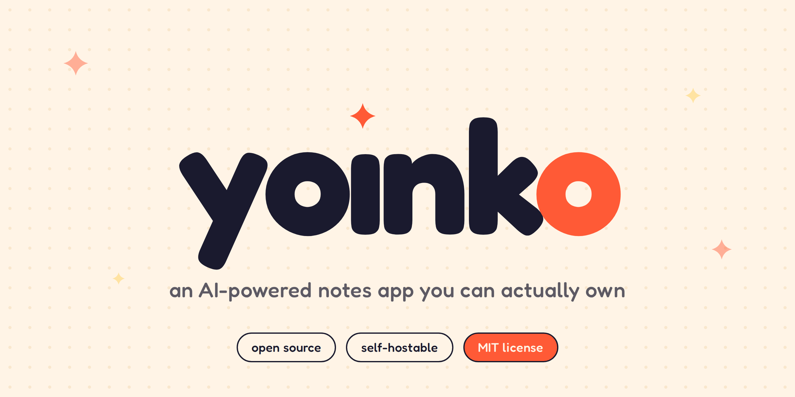

<div align="center">



<br/>

[](./LICENSE)
[](https://nodejs.org)
[](https://github.com/arena-code/yoinko.ai/stargazers)
[](https://github.com/arena-code/yoinko.ai/discussions)

### describe it. yoink it. done.

**[yoinko.ai](https://yoinko.ai)** &nbsp;·&nbsp; [report a bug](https://github.com/arena-code/yoinko.ai/issues/new) &nbsp;·&nbsp; [roadmap](https://github.com/arena-code/yoinko.ai/projects)

</div>

<br/>

## Table of Contents

- [What is yoınko?](#what-is-yoınko)
- [Quick Start](#quick-start)
- [Updating](#updating)
- [Configuration](#configuration)
- [Project Structure](#project-structure)
- [Architecture](#architecture)
- [Development](#development)
- [Roadmap](#roadmap)
- [Contributing](#contributing)
- [Contributors](#contributors)
- [FAQ](#faq)
- [License](#license)

<br/>

## What is yoınko?

yoınko is an AI-native knowledge base that runs on your own machine. You write in Markdown or HTML, organize pages into folders, and the AI lives in a chat drawer on the right — ready to draft new sections, summarize what you've written, generate checklists, or create images from a description. Everything saves to a local SQLite database. Nothing is locked away.

```
┌─ pages ─────────┐  ┌─ page view ────────────────────┐  ┌─ ask yoinko ───┐
│ 01 home         │  │                                │  │                │
│ 02 product ◀ ── │  │ # overview                     │  │ > summarize    │
│   overview  ✦   │  │                                │  │   this page    │
│   roadmap       │  │ yoınko is a plain-text-first…  │  │                │
│   changelog     │  │                                │  │ sure, here's   │
│ 03 engineering  │  │ ## what makes it different     │  │ 3 bullets:     │
│ 04 meetings     │  │ - bring your own LLM           │  │ • markdown…    │
│                 │  │ - files stay on your disk      │  │ • BYO LLM      │
│ ＋ page/folder  │  │ - AI knows the current page    │  │ • open source  │
└─────────────────┘  └────────────────────────────────┘  └────────────────┘
```

**Key features:**

- **Markdown & HTML pages** — TipTap-based WYSIWYG editor with live preview for HTML
- **AI chat drawer** — context-aware chat that knows your current page; apply replies directly
- **AI image generation** — generate images via DALL-E, Imagen, or any compatible endpoint
- **Bring your own LLM** — OpenAI, Google Gemini, Anthropic Claude, or any OpenAI-compatible endpoint (Ollama, LM Studio, OpenRouter)
- **Folder tree** — nested folders, drag-free ordering, right-click context menus
- **Asset management** — upload, preview, and delete files attached to any page
- **Light & dark mode**

<br/>

## Quick Start

### Option A — one command (Clone + Setup)

Run this in any empty folder to clone the repo and set everything up:

```bash
curl -fsSL https://raw.githubusercontent.com/arena-code/yoinko.ai/main/scripts/setup.sh | bash
```

Or, if you've already cloned:

```bash
git clone https://github.com/arena-code/yoinko.ai.git
cd yoinko.ai
bash scripts/setup.sh
```

Then start the dev server:

```bash
npm run dev
```

Open [http://localhost:4567](http://localhost:4567) — you're in.

---

### Option B — manual setup

**Requirements:** Node.js 20+, npm 9+

```bash
# 1. Clone
git clone https://github.com/arena-code/yoinko.ai.git
cd yoinko.ai

# 2. Install
npm install

# 3. Build client bundle
npm run build:client
npm run build:editor

# 4. Start
npm run dev        # development (hot reload)
npm start          # production (after npm run build)
```

<br/>

## Configuration

All settings are managed **in-app** via the ⚙️ Settings modal. No config files are required to get started.

### LLM Provider

Open Settings → pick your provider → paste your API key → Save.

| Provider              | What you need                                                       |
| --------------------- | ------------------------------------------------------------------- |
| **OpenAI**            | API key from [platform.openai.com](https://platform.openai.com)     |
| **Google Gemini**     | API key from [aistudio.google.com](https://aistudio.google.com)     |
| **Anthropic Claude**  | API key from [console.anthropic.com](https://console.anthropic.com) |
| **OpenAI Compatible** | Set Base URL to any OpenAI-compatible endpoint                      |

> **Local models (Ollama, LM Studio):** Choose _OpenAI Compatible_ and set the Base URL to `http://localhost:11434/v1` or wherever your instance runs.

### Environment Variables (optional)

Copy `.env` (created by the setup script) and edit:

```env
PORT=4567        # server port (default: 4567)
```

LLM credentials are stored in the local SQLite database and managed via the Settings modal — not environment variables.

<br/>

## Project Structure

```
yoinko.ai/
├── public/               # static assets served directly
│   ├── css/
│   │   └── app.css       # all application styles (single file)
│   ├── js/
│   │   ├── app.bundle.js     # compiled client bundle
│   │   └── tiptap.bundle.js  # TipTap editor bundle
│   └── index.html        # single-page app shell
│
├── src/
│   ├── client/           # frontend TypeScript
│   │   ├── app.ts        # main application logic (navigation, modals, editor)
│   │   └── api.ts        # typed API client
│   ├── server/           # backend Node.js/Express
│   │   ├── index.ts      # server entry point
│   │   ├── db.ts         # SQLite setup & helpers
│   │   ├── ai/
│   │   │   └── index.ts  # unified LLM adapter (OpenAI / Gemini / Claude)
│   │   └── routes/
│   │       ├── pages.ts  # CRUD for pages and folders
│   │       ├── assets.ts # file uploads and management
│   │       ├── ai.ts     # text generation, streaming chat, image generation
│   │       └── settings.ts
│   └── shared/
│       └── types.ts      # shared TypeScript types
│
├── scripts/
│   ├── setup.sh          # one-command setup script
│   ├── build-client.js   # esbuild client bundle
│   ├── build-editor.js   # esbuild TipTap bundle
│   └── watch-client.js   # dev watcher with live-reload SSE
│
├── data/                 # runtime data (SQLite DB + uploaded assets)
│   └── uploads/
│
├── package.json
└── tsconfig.json
```

<br/>

## Architecture

```
┌─────────────────────────────────────────────┐
│  browser (vanilla TS, no framework)         │
│  ├─ TipTap WYSIWYG editor (Markdown)        │
│  ├─ HTML split-pane editor + preview        │
│  ├─ folder tree + context menus             │
│  └─ AI chat drawer (SSE streaming)          │
└────────────┬──────────────┬────────────────┘
             │ REST API     │ SSE streaming
             ▼              ▼
┌─────────────────────────────────────────────┐
│  yoınko server (Node.js + Express)          │
│  ├─ SQLite (pages, assets, settings, chat)  │
│  ├─ file uploads (local disk)               │
│  └─ LLM proxy (your key, your traffic)      │
└─────────────────────────────────────────────┘
             │
             ▼
      your chosen LLM
  OpenAI · Gemini · Claude · Ollama · …
```

- **No framework.** The client is vanilla TypeScript bundled with esbuild. Fast to load, easy to read.
- **SQLite for everything.** Pages, folder structure, assets, settings, and chat history all live in a single `data/yoinko.db` file. Easy to backup, easy to migrate.
- **LLM calls are proxied server-side.** Your API key never reaches the browser.
- **Live reload in dev.** A lightweight SSE channel on port 4568 pushes reloads whenever you save a `.ts`, `.css`, or `.html` file.

<br/>

## Development

```bash
npm run dev           # start server + file watcher with live reload
npm run build         # full production build (server + client + editor)
npm run build:client  # rebuild client bundle only
npm run build:editor  # rebuild TipTap bundle only
```

The dev server runs on **:4567** and the live-reload SSE channel on **:4568**.

### Tech Stack

| Layer    | Tech                    |
| -------- | ----------------------- |
| Runtime  | Node.js 20+             |
| Server   | Express                 |
| Database | SQLite (better-sqlite3) |
| Client   | Vanilla TypeScript      |
| Bundler  | esbuild                 |
| Editor   | TipTap (ProseMirror)    |
| Styling  | Vanilla CSS             |

<br/>

## Updating

Already running yoınko locally and want to pull the latest changes? Three steps:

```bash
# 1. Pull the latest code
git pull origin main

# 2. Install any new dependencies
npm install

# 3. Rebuild the client bundle
npm run build:client
npm run build:editor

# 4. Restart the server
npm run dev
```

> Your data lives in `./data/` and is never touched by a pull or rebuild — **your pages and settings are safe**.

### Handling database migrations

yoınko runs schema migrations automatically on server start. If a new version adds a column or table, it will be applied the first time you run `npm run dev` after pulling. No manual SQL needed.

### Quick update script

If you want a one-liner:

```bash
git pull origin main && npm install && npm run build:client && npm run build:editor
```

Then restart your dev server.

<br/>

## Roadmap

yoınko is **pre-1.0**. The core (pages, folders, markdown, HTML, AI chat, AI images, BYO LLM) works. Planned:

- [ ] **GitHub sync** — commit on save, full version history, undo to any point
- [ ] **Tasks page** — kanban/checklist view with agent delegation
- [ ] **Mobile reader** — read-only iOS/Android companion app
- [ ] **Agent integrations** — Open Interpreter, OpenHands, Khoj
- [ ] **Plugins API** — extend the editor and sidebar with custom panels

Vote on what matters most in [Discussions](https://github.com/arena-code/yoinko.ai/discussions) or subscribe to [issues](https://github.com/arena-code/yoinko.ai/issues).

<br/>

## Contributing

PRs are welcome. Please keep these in mind:

1. **Open an issue first** for anything beyond typos — it saves everyone time
2. **Keep the stack simple** — no new frameworks without a very good reason
3. **One concern per PR** — easier to review, easier to revert

```bash
git clone https://github.com/arena-code/yoinko.ai.git
cd yoinko.ai
npm install
npm run dev
# make your change, open a PR
```

<br/>

## FAQ

<details>
<summary><strong>Can I use it without an LLM?</strong></summary>

Yes. Without a configured provider the AI features (chat, AI sections, image generation) are disabled, but the editor, folders, and asset management work fine. The LLM is optional.

</details>

<details>
<summary><strong>Where is my data stored?</strong></summary>

Everything lives in `./data/`. The SQLite database is `data/yoinko.db` and uploaded files are in `data/uploads/`. Back it up like any file.

</details>

<details>
<summary><strong>Can I use local models?</strong></summary>

Yes. Choose **OpenAI Compatible** in Settings and set the Base URL to your local endpoint (e.g. `http://localhost:11434/v1` for Ollama). Set any model name you want.

</details>

<details>
<summary><strong>Can I export my data?</strong></summary>

Your pages are rows in the SQLite DB with plain Markdown/HTML content — readable without any special tooling. You can also copy the entire `data/` directory anywhere.

</details>

<details>
<summary><strong>Why not Electron / Tauri / desktop app?</strong></summary>

A local web server is simpler to ship, easier to self-host on a VPS or NAS, and works in any browser. If there's enough demand for a native wrapper, it's on the list.

</details>

<br/>

## Contributors

Thanks to everyone who has contributed to yoınko!

[](https://github.com/arena-code/yoinko.ai/graphs/contributors)

Want to join the list? Check out the [Contributing](#contributing) section above — all contributions are welcome, from code and docs to bug reports and ideas.

<br/>

## License

[MIT](./LICENSE) — do whatever you want with it.

<br/>

<div align="center">

**[yoinko.ai](https://yoinko.ai)** &nbsp;·&nbsp; [@yoinko_ai](https://twitter.com/yoinko_ai) &nbsp;·&nbsp; made with ✦ in brazil

</div>
